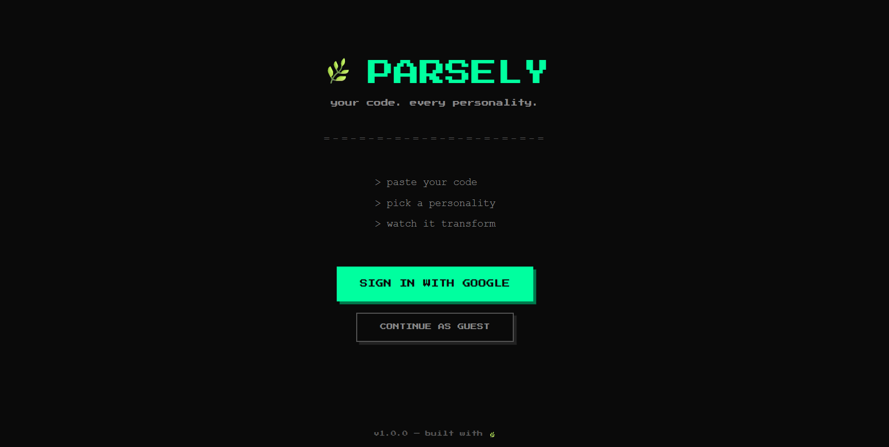
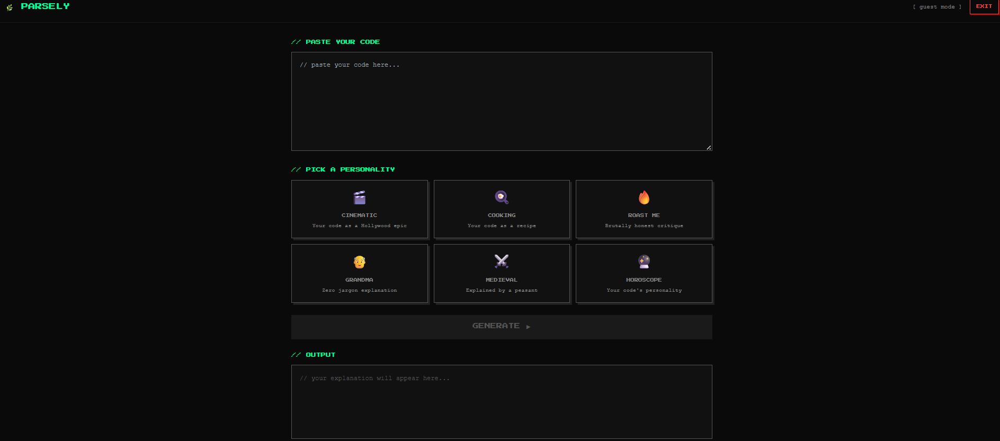
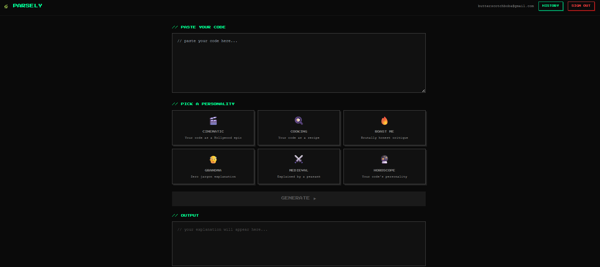
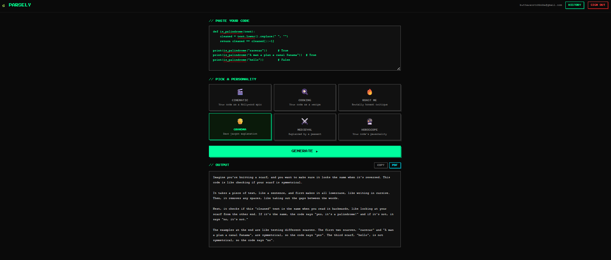
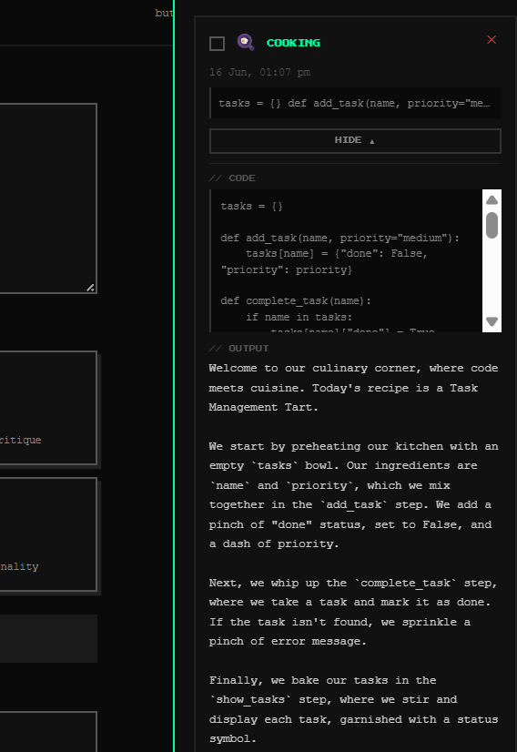
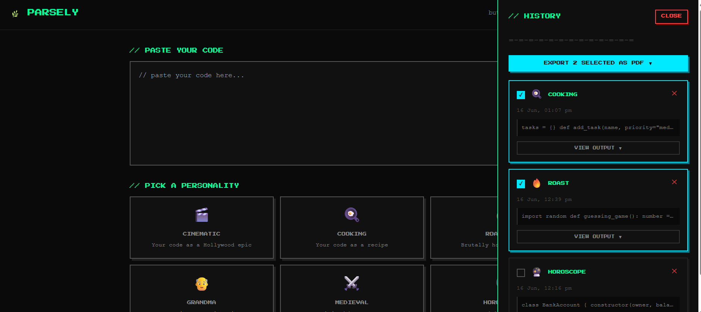

# 🌿 Parsely

An AI-powered web app that explains any code snippet through 6 wildly different creative personalities — from a Hollywood screenwriter to a medieval peasant.

🔗 **Live demo:** https://parsely-steel.vercel.app

## What does it do?

You paste any code snippet, pick a personality, and Parsely explains it in that voice. Want your bubble sort explained as a cooking recipe? Done. Want a class roasted by a savage critic? Done. Want a recursive function explained to your grandma? Also done.

Sign in with Google to save your explanation history and export any output as a PDF.

## Screenshots

**Login Page**


**Main App — Guest Mode**


**Main App — Signed In**


**AI Output**



**History Panel — Expanded**




**History Panel — Bulk Export**


---

📄 [View sample exported PDF](samples/parsely-history.pdf)

## Features

- **6 AI personalities** — each one explains your code in a completely different voice and style
- **Google Sign-In or Guest mode** — use it without an account, sign in to unlock history
- **Explanation history** — every output saved automatically with timestamp and mode
- **PDF export** — export any single explanation or select multiple from history and export as one PDF
- **Retro pixel UI** — dark theme with Press Start 2P font and neon green accents

## The 6 Modes

| Mode | What it does |
|---|---|
| 🎬 Cinematic | Your code narrated as a Hollywood epic |
| 🍳 Cooking | Your code explained as a step-by-step recipe |
| 🔥 Roast Me | A savage critic tears your code apart |
| 👴 Grandma | Zero jargon, grandma-friendly explanation |
| ⚔️ Medieval | Explained by a terrified 13th century peasant |
| 🔮 Horoscope | Your code's personality, flaws, and fate |

## Built With

- **Frontend** (what you see): React + Vite, Tailwind CSS, Press Start 2P font
- **AI** (generates the explanations): Groq API running Llama 3.3 70B — free tier, no credit card needed
- **Auth** (login system): Supabase Google OAuth
- **Database** (stores history): Supabase PostgreSQL with Row Level Security
- **PDF generation**: jsPDF — runs entirely in the browser
- **Deployment**: Vercel

## How to Run This Yourself

You only need to run the frontend — there's no separate backend server.

### 1. Clone the repo

```bash
git clone https://github.com/YOURUSERNAME/parsely.git
cd parsely
```

### 2. Install dependencies

```bash
npm install
```

### 3. Create a `.env` file in the root folder and add your keys

```
VITE_SUPABASE_URL=your_supabase_project_url
VITE_SUPABASE_ANON_KEY=your_supabase_anon_key
VITE_GROQ_API_KEY=your_groq_api_key
```

Where to get each key:
- `VITE_SUPABASE_URL` and `VITE_SUPABASE_ANON_KEY` — create a free project at supabase.com, then go to Project Settings → API
- `VITE_GROQ_API_KEY` — create a free account at console.groq.com → API Keys

### 4. Set up the Supabase database

Go to your Supabase dashboard → SQL Editor and run this:

```sql
create table history (
  id uuid default gen_random_uuid() primary key,
  user_id uuid references auth.users(id) on delete cascade,
  code text not null,
  mode text not null,
  output text not null,
  created_at timestamptz default now()
);

alter table history enable row level security;

create policy "allow all for authenticated users"
  on history for all
  to authenticated
  using (auth.uid() = user_id)
  with check (auth.uid() = user_id);
```

### 5. Enable Google Auth in Supabase

- Go to Authentication → Providers → Google → toggle ON
- Follow the [Supabase Google OAuth guide](https://supabase.com/docs/guides/auth/social-login/auth-google) to get your Client ID and Secret from Google Cloud Console

### 6. Start the app

```bash
npm run dev
```

Open http://localhost:5173 and you're good to go.

## Project Structure

```
src/
├── components/
│   ├── Auth/
│   │   └── LoginPage.jsx       # Google sign-in + guest mode UI
│   ├── CodeInput.jsx           # Code paste textarea
│   ├── ModeSelector.jsx        # 6 personality cards
│   ├── OutputPanel.jsx         # AI response + copy + PDF export
│   └── HistoryPanel.jsx        # Saved history with bulk PDF export
├── api/
│   └── gemini.js               # Groq API call
├── hooks/
│   └── useHistory.js           # Save, fetch, delete history from Supabase
├── lib/
│   └── supabase.js             # Supabase client setup
├── prompts/
│   └── modes.js                # System prompts for all 6 personalities
└── App.jsx                     # Auth state + main layout
```

## What's Next

- Mobile responsive design — the app is currently optimised for desktop
- Share button — generate a shareable link for any explanation
- Custom mode — write your own system prompt and create your own personality
- Side-by-side view — compare two modes on the same code at once
- Syntax highlighting in the code input

## About This Project

Parsely was built as a portfolio project to practice full-stack development — combining a React frontend, AI API integration, Google OAuth, a PostgreSQL database, and PDF generation into one cohesive (and genuinely fun) app.

